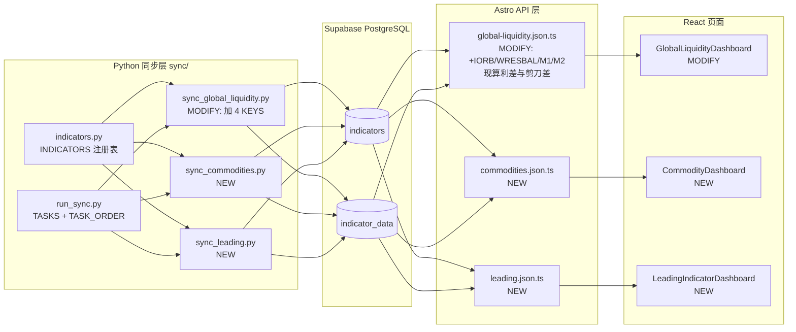

## 产品概述
为「MACRO EDGE 宏观投资研究终端」补齐三组此前完全缺失的宏观指标，全部走现有 FRED 数据源，不涉及中国维度。目标是补全三条被打断的分析传导链：流动性链（准备金/政策利率底）、商品链（通胀与需求的前瞻验证）、领先链（衰退预警的高频信号）。

## 核心功能

**一、流动性缺口补齐（并入现有「全球流动性」页，不新增路由）**
- 新增准备金余额利率 IORB、银行体系准备金 WRESBAL 两条原始序列，补上知识图谱中已承诺但数据层缺失的「准备金 → SOFR」传导边
- 新增 M1 / M2 货币供应量，并派生 M1-M2 剪刀差
- 派生 SOFR − IORB 利差（基点），为裸 SOFR 提供政策利率基准，作为回购市场紧张度的最早期体温计
- 现有「净流动性」实现完整保留、不重构

**二、大宗商品页（新增 `/indicators/commodities`）**
- WTI 原油、布伦特原油、铜（LME）、铁矿石、Henry Hub 天然气
- 派生布伦特-WTI 价差、金油比（复用已有黄金数据）
- 各品种展示当前值、同比、5 年分位与历史曲线

**三、领先指标页（新增 `/indicators/leading`）**
- 高频核心：NFCI 金融状况指数（周）、初请失业金 ICSA（周）
- 月度补充：失业率 UNRATE、工业产出 INDPRO、营建许可 PERMIT、耐用品新订单 DGORDER、产能利用率 TCU、密歇根消费者信心 UMCSENT
- 派生 Sahm Rule 衰退信号（由 UNRATE 单序列计算，零新增数据源）

## 边界与约束
- 不含中国维度（用户明确要求后续单独处理）
- 不改动 `analysis_results` 表结构
- 不重构现有净流动性实现
- ISM 序列需先做可用性探测，不可用则降级为耐用品新订单 + 工业产出，不写死为必选


## 技术栈
沿用项目现有技术栈，不引入新依赖：
- 前端：Astro 5（SSR，`prerender = false`）+ React 18 岛屿 + ECharts + Tailwind
- 部署：Cloudflare Worker（`@astrojs/cloudflare`）
- 数据库：Supabase PostgreSQL，TS 侧经 `@neondatabase/serverless` 访问（占位符 `?`）
- 同步层：Python 3 + psycopg2（`sync/`，占位符 `%s`），数据源 FRED API

## 实施策略

**核心判断：全部指标均走 FRED，零同步引擎改动。** 已验证 `sync/indicators.py` 的 `_sync_one()` 对非 fred 源直接 `raise`（第 298 行），而本轮三组指标的 FRED series 全部可用，因此只需扩充 `INDICATORS` 注册表 + 新增两个 sync 脚本，不触碰取数引擎。

**关键决策与权衡：**

1. **派生指标放 API 层而非入库** — SOFR−IORB 利差、M1-M2 剪刀差、Sahm Rule 均为纯算术派生，入库会造成冗余存储与同步时序耦合。在 API 层用 Map 对齐日期后现算，与现有 `global-liquidity.json.ts` 实时算 netLiquidity 的模式保持一致。

2. **商品页与领先页采用「实时查询」而非预计算** — 现有架构中 `analysis/liquidity`、`analysis/credit-stress` 等 6 个重分析接口走 `analysis_results` 预计算表，是为了规避 Worker CPU 超限。但本轮两个新页只是「多序列并排展示 + 简单派生」，计算量远小于相关性矩阵/前瞻收益统计，采用 `global-liquidity.json.ts` 的实时查询模式更简洁，且免去新增预计算任务的时序编排。若后续发现性能问题再迁移到预计算。

3. **频率对齐策略** — 商品组混有日频（WTI/Brent/天然气）与月频（铜/铁矿），领先组混有周频（NFCI/ICSA）与月频（其余）。统一采用「日频主轴 + 前向填充 ffill」对齐，复用现有 `ffillMap()` / `_ffill()` 模式，避免图表出现锯齿断裂。

4. **不新建通用商品框架** — 坚持 YAGNI，按当前 5 个品种硬编码 `CODES` 列表即可；若未来扩到 10+ 品种再抽象配置层。

## 架构与数据流



## 实施注意事项（防回归要点）

- **必须先探测 FRED 序列可用性再写代码**：ISM 相关序列（`NAPM`/`NEWORDER`/`MANEMP`）历史上曾被 FRED 下架。第一步就要用 FRED API 逐条探测本轮全部 series，不可用的立即降级（ISM → `DGORDER` 耐用品新订单 + `TCU` 产能利用率），不写死。
- **TS 用 `?` 占位符、Python 用 `%s`**，两套不可混用（`sync_base.py` 的 SQL 改写层只处理 Python 侧）。
- **PostgreSQL jsonb 不接受 NaN/Infinity**：任何新增写 `analysis_results` 的逻辑必须复用 `sync_base.py` 的 `json_sanitize()` + `dumps_json(allow_nan=False)`，否则整行 upsert 失败。本轮虽不新增预计算，但若后续迁移需注意。
- **`run_sync.py` 的 `TASK_ORDER` 必须同步更新**，新任务挂在取数层（本轮无预计算任务，故排在 `macro_analysis` 之后即可）。
- **region 取值沿用现有约定**：`'US'` 与 `'GLOBAL'`。流动性相关归 `GLOBAL`，纯美国宏观归 `US`。
- **日频序列的 FRED 缺失值**：FRED 用 `"."` 表示缺失，现有 `fetch_fred()` 已过滤，前端需处理 `value: null` 以免图表断点异常。
- **沿用现有图表工厂**：`src/lib/chartOptions.ts` 的 `lineSeries`/`barSeries`/`categoryAxis`/`valueAxis`/`chartTooltip`/`chartLegend`/`chartGrid`/`chartDataZoom`，不新造图表配置。

## 目录结构

```
sync/
├── indicators.py                  # [MODIFY] 在 INDICATORS 注册表新增 17 条指标定义
│                                  #   - 流动性组 4 条：IORB / BANK_RESERVES / M1 / M2
│                                  #   - 商品组 5 条：WTI / BRENT / COPPER / IRON_ORE / NATGAS
│                                  #   - 领先组 8 条：NFCI / ICSA / UNRATE / INDPRO / PERMIT /
│                                  #                   DGORDER / TCU / UMCSENT
├── sync_global_liquidity.py       # [MODIFY] KEYS 列表新增 4 个流动性指标 key
├── sync_commodities.py            # [NEW] 商品组同步脚本，照抄 sync_global_liquidity.py 最简模板
├── sync_leading.py                # [NEW] 领先指标组同步脚本，同上模板
├── run_sync.py                    # [MODIFY] TASKS 注册 commodities / leading 两个任务，
│                                  #          并加入 TASK_ORDER 取数层
└── probe_fred_series.py           # [NEW] 一次性探测脚本，校验 FRED series 可用性后即删

src/lib/
└── core.ts                        # [MODIFY] 新增 LiquidityIndicatorCode 联合类型的 4 个新 code，
                                   #          以及 CommodityResponse / LeadingResponse 接口

src/pages/api/v1/
├── global-liquidity.json.ts       # [MODIFY] CODES 扩到 10 条；新增 sofrIorbSpread、
│                                  #          m1M2Spread 两个派生序列的实时计算
├── commodities.json.ts            # [NEW] 商品 API，实时查 5 序列 + 派生 Brent-WTI 价差与金油比
└── leading.json.ts                # [NEW] 领先指标 API，实时查 8 序列 + 派生 Sahm Rule

src/pages/indicators/
├── global-liquidity.astro         # [MODIFY] IndicatorGuide 文案补充准备金/货币供应说明
├── commodities.astro              # [NEW] 商品页（Layout + PageHeader + IndicatorGuide + 岛屿组件）
└── leading.astro                  # [NEW] 领先指标页（同上结构）

src/components/
├── GlobalLiquidityDashboard.tsx   # [MODIFY] CODE 常量 +4；SofrChart 改为 SOFR vs IORB 双线；
│                                  #          新增 MoneySupplyChart；StatTile 网格扩展
├── CommodityDashboard.tsx         # [NEW] 商品页主组件
└── LeadingIndicatorDashboard.tsx  # [NEW] 领先指标页主组件

src/components/
└── Sidebar.astro                  # [MODIFY] navGroups 的「指标」组新增商品、领先指标两项
```


## 设计总纲
延续现有「MACRO EDGE 宏观投资研究终端」的金融终端美学：深色底、高信息密度、等宽字体标注数值、克制的强调色。新页面必须严格复用现有设计原语（`Layout` / `PageHeader` / `IndicatorGuide` / `MacroCard` / `StatTile` / `ResponsiveChartBox`），做到与「全球流动性」「信用压力」等既有页面在视觉语言上完全统一，看起来像原生功能而非外挂模块。

## 一、全球流动性页改造（并入，不新增路由）

**Block 1 — 顶部指标磁贴网格（改造）**
现有 `grid-cols-2 lg:grid-cols-5` 扩展为 `lg:grid-cols-7`，净流动性磁贴保持 `col-span-2` 主位与强调色底。新增四枚：IORB、银行准备金、M1 同比、M2 同比。每枚沿用 `StatTile` 的 `value + sub(Δ) + tone` 三段式。

**Block 2 — SOFR vs IORB 双线图（改造 `SofrChart`）**
由单线改为双线：SOFR 实线、IORB 虚线（政策利率底）。两条线之间用半透明 `areaStyle` 填充，利差为正时填充转红（融资紧张）、为负时转青（宽松）。零轴用 `markLine` 标注。标题改为「SOFR − IORB 利差 — 回购市场紧张度」。

**Block 3 — 货币供应剪刀差图（新增）**
M1 同比与 M2 同比双线，叠加一条「M1同比 − M2同比」的柱状差（复用 `barSeries`，`barMaxWidth: 3`）。剪刀差转负区间加红色 `markArea`。此图直接呼应知识图谱「通缩」卡片的预警链条。

**Block 4 — 准备金水位图（新增）**
银行准备金单线面积图，纵轴万亿美元，标注「LCLoR 最低充裕水平」参考区间，背景保留 2019 回购危机等历史事件 `markLine`。此图补齐知识图谱中 `reserves → sofr` 那条断了的数据边。

## 二、大宗商品页（新增 `/indicators/commodities`）

**Block 1 — 页头与投资指引**
`PageHeader` 副标题「WTI · 布伦特 · 铜 · 铁矿石 · 天然气」；`IndicatorGuide` 的 `summary` 槽位给出判读规则：工业金属与能源同涨=需求扩张，能源涨而金属跌=供给冲击，全线下跌=需求收缩。

**Block 2 — 品种价格磁贴行**
5 枚 `StatTile` 横排，各显示当前价、单位、同比变化。同比为正用暖色，为负用冷色。

**Block 3 — 能源板块图**
WTI、布伦特、天然气三条线做双 Y 轴（原油左轴美元/桶，天然气右轴美元/百万英热），避免量纲差异导致天然气被压平。

**Block 4 — 金属板块图**
铜与铁矿双线单轴（均为美元/吨量纲），月度序列用 `dataZoom` 默认展示近 5 年。

**Block 5 — 价差与比值图**
布伦特-WTI 价差折线 + 金油比（复用已有黄金数据）副线，双 Y 轴。此区块是商品的相对价值信号源。

## 三、领先指标页（新增 `/indicators/leading`）

**Block 1 — 页头与投资指引**
副标题「金融状况 · 就业 · 生产 · 地产 · 信心」；`summary` 槽位给出衰退预警规则：Sahm Rule ≥ 0.5 且 NFCI 转正 = 高置信衰退信号。

**Block 2 — Sahm Rule 告警卡（置顶）**
全页最醒目的位置。用 `MacroCard` 包裹，根据 `UNRATE` 派生值染色：≥ 0.5 红色告警、0.3–0.5 黄色警示、< 0.3 绿色安全。卡片内显示当前值、触发阈值、以及一句状态描述。这是本页信息增量最高、成本最低的组件。

**Block 3 — 高频信号区（周频）**
NFCI 与初请失业金两张图并排。NFCI 图加零轴 `markLine`（零轴上方=金融环境收紧）；初请图用柱状 + 4 周移动均线（复用 `barSeries` + `lineSeries` 叠加模式）。

**Block 4 — 生产与需求区（月频）**
工业产出指数、产能利用率、耐用品新订单三线图，统一按同比归一化到同一纵轴，便于横向比较景气度。

**Block 5 — 地产与信心区（月频）**
营建许可（千套）与密歇根消费者信心双 Y 轴图。地产是利率传导最灵敏的部门，信心是消费的前瞻。

## 交互与响应式
- 所有图表复用 `ResponsiveChartBox`，保留 `chartDataZoom` 缩放
- 加载态用 `LoadingSkeleton`、错误用 `ErrorState`、空数据用 `EmptyState`，与既有页面完全一致
- 桌面端图表并排 (`lg:grid-cols-2`)，移动端单列堆叠
- 沿用 `useChartTheme()` 主题 hook，确保深色/浅色模式切换时配色自适应


## Agent Extensions
### SubAgent
- **code-explorer**
  - Purpose: 在实施阶段核实现有组件的精确签名与用法，特别是 `src/lib/chartOptions.ts` 中各图表工厂函数（`lineSeries` / `barSeries` / `valueAxis` / `markLine` 配置）的参数结构，以及 `StatTile` / `MacroCard` / `ResponsiveChartBox` 的 props 契约
  - Expected outcome: 新增的三个前端组件不靠猜测拼装，而是精确复用现有原语，避免类型错误与视觉不一致

## TODOS

- [x] 编写并运行 probe 脚本，逐条验证 17 个 FRED series 可用性，确定 ISM 降级方案
- [x] 在 sync/indicators.py 注册表新增三组共 17 条指标定义
- [x] 新增 sync_commodities.py 与 sync_leading.py，改造 sync_global_liquidity.py，并在 run_sync.py 注册任务与执行顺序
- [ ] 执行 dry-run：验证连库、指标定义 UPSERT 进 indicators 表，不拉全量历史
      ⚠ 阻塞（环境，非代码）：本机无法连到 Supabase。DATABASE_URL 指向直连域名 db.*.supabase.co（仅 AAAA/IPv6，无 IPv4 A 记录），而本机 Winsock getaddrinfo 解析不出 IPv6、且 IPv6 路由不可达（WinError 10051）。脚本 sync/dryrun_check.py 与 17 条注册表定义均已就绪，待在可连库环境执行 `python sync/dryrun_check.py`（建议将 .env 的 DATABASE_URL 换成 Supabase pooler 连接串 aws-0-<region>.pooler.supabase.com，该域名有 IPv4）。
- [x] 在 src/lib/core.ts 扩展类型，改造 global-liquidity.json.ts 并新增 commodities.json.ts 与 leading.json.ts
- [x] 改造 GlobalLiquidityDashboard.tsx：SOFR/IORB 双线图、准备金图、货币剪刀差图与扩展磁贴
- [x] 用 [subagent:code-explorer] 核实图表原语后，新增 CommodityDashboard.tsx 与 LeadingIndicatorDashboard.tsx 及两个 astro 页面
- [x] 更新 Sidebar.astro 导航与全球流动性页 IndicatorGuide 文案，执行 typecheck 校验
      ✅ Sidebar「指标」组已加「大宗商品」「领先指标」；global-liquidity.astro 的 IndicatorGuide 补充 SOFR/IORB、银行准备金、M1/M2 剪刀差说明；`npx tsc --noEmit` 退出码 0。